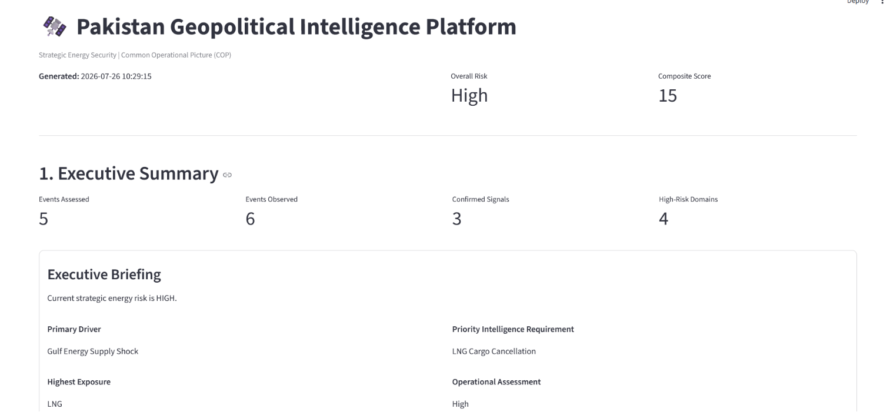
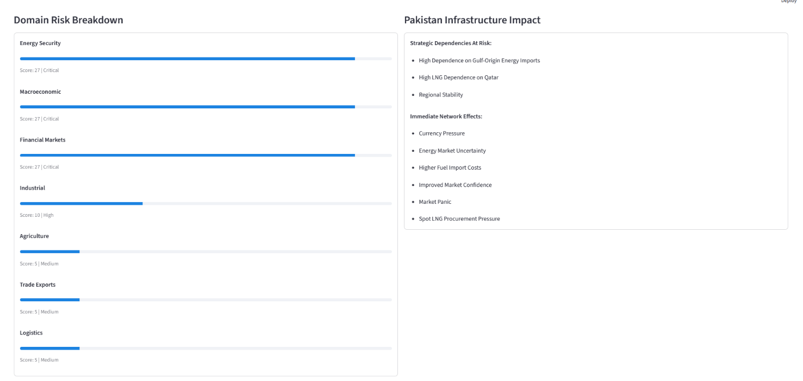
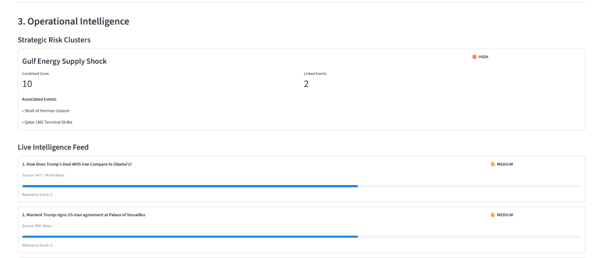

# 🛰️ Pakistan Geopolitical Intelligence Platform

A modular, ontology-driven strategic intelligence platform built to evaluate geopolitical events, energy security, supply chain exposure, and cascading strategic risks affecting Pakistan.
---

## 🎯 Executive Overview

Most geopolitical tracking tools simply aggregate RSS feeds and display disconnected news headlines. This platform transforms unstructured event signals into **structured, explainable, and actionable intelligence products**.

By decoupling intelligence generation from presentation, the system builds a single **Common Operational Picture (COP)** that powers both a high-command Streamlit dashboard and a command-line strategic risk briefing.

Unlike traditional dashboards that independently calculate analytical outputs, this platform centralizes all intelligence generation inside a Common Operational Picture (COP). Every presentation layer consumes the same intelligence object, ensuring consistency, explainability, and maintainability across the system.

```
Intelligence Sources
        │
        ▼
RSS Ingestion
        │
        ▼
Ontology Classification
        │
        ▼
SQLite Repository
        │
        ▼
Intelligence Engine
        │
        ▼
Common Operational Picture
        │
   ┌────┴─────┐
   ▼          ▼
Dashboard   Risk Report
```
---
## 📸 Platform Preview

The platform generates a unified **Common Operational Picture (COP)** through both an interactive Streamlit dashboard and a command-line executive intelligence report.

### Executive Summary

Provides an immediate strategic assessment including the Bottom Line Up Front (BLUF), overall operational risk, primary threat drivers, and priority intelligence requirements.



---

### Operational Picture

Visualizes comparative domain risk, commodity exposure, and Pakistan-specific infrastructure impacts derived from the Common Operational Picture.



---

### Operational Intelligence

Displays correlated strategic risk clusters together with the live intelligence feed and relevance scoring of detected geopolitical events.




## Strategic Outlook

Provides cascading effects analysis, escalation indicators, priority intelligence requirements (PIRs), and forward-looking strategic assessment.


---
## 🔑 Key Engineering Achievements

* **Unified Common Operational Picture (COP):** Single-source-of-truth pipeline that calculates multi-domain risk, exposure matrices, and scenarios in a unified payload.
* **Pure Client-Presenter Architecture:** Presentation components (web UI and CLI tools) act as pure clients—they consume the pre-calculated COP without duplicating risk calculations or business logic.
* **Ontology-Driven Classification:** Powered by a structured YAML taxonomy defining event triggers, impact domains, cascade orders, and escalation indicators.
* **Correlated Threat Clustering:** Aggregates isolated tactical signals into systemic, high-level crisis clusters with combined threat scoring.
* **Forward-Looking Scenario Forecasting:** Maps events to triple-scenario outcomes (*Most Likely*, *Severe Case*, *Best Case*) with dynamic confidence evaluation.
* **National Exposure Profiling:** Tracks commodity vulnerabilities (*LNG, Crude Oil, Power Generation*) and national infrastructure impacts specific to Pakistan.


---
## 🛠️ Intelligence Products

| Module | Technical Function | Analytical Output |
| --- | --- | --- |
| **Executive Analytic Judgment** | Synthesis of top signals | Bottom Line Up Front (BLUF) risk statement |
| **Composite Risk Engine** | Highest Score + Event Count + Domain Multipliers | Overall System Risk Level (*Critical, High, Medium, Low*) |
| **Correlated Risk Clusters** | Cluster aggregation algorithms | Systemic threat grouping (e.g., *Gulf Energy Supply Shock*) |
| **Commodity Exposure Tracking** | Rank-order escalation matrix | Vulnerability tracking across critical fuels |
| **Cascading Risk Modeling** | Multi-order dependency mapping | 1st-Order (Immediate), 2nd-Order (Delayed), 3rd-Order (Systemic) |
| **Escalation Indicators (PIRs)** | Signal pattern matching | High, Medium, and Baseline Priority Intelligence Requirements |
| **Source Confidence Matrix** | Multi-source confirmation & reliability scoring | Composite verification weighting (*Very High* to *Low*) |

---

## 📁 Repository Directory Structure

```text
geopolitical-energy-intelligence/
├── config/
│   └── event_taxonomy.yaml         # Geopolitical event ontology & rule definitions
├── src/
│   ├── analysis/
│   │   └── intelligence_engine.py  # Core processing engine & COP builder
│   ├── dashboard/
│   │   └── app.py                  # Streamlit Strategic Operations Center (UI)
│   ├── reporting/
│   │   └── risk_report.py          # CLI executive intelligence presenter
│   └── storage/
│       └── event_store.py          # SQLite persistence & telemetry repository
├── requirements.txt                # System dependencies
└── README.md                       # Project documentation

```

---

## ⚡ Quickstart & Installation

### Prerequisites

* Python 3.10+ installed
* Git

### 1. Clone & Set Up Environment

```bash
# Clone the repository
git clone https://github.com/zafar-labs/geopolitical-energy-intelligence.git
cd geopolitical-energy-intelligence

# Create virtual environment
python -m venv .venv

# Activate virtual environment
# Windows (PowerShell):
.venv\Scripts\Activate.ps1
# macOS/Linux:
source .venv/bin/activate

# Install dependencies
pip install -r requirements.txt

```

### 2. Run the Executive CLI Risk Report

Generate a formal command-line intelligence brief directly from the engine:

```bash
python src/reporting/risk_report.py

```

### 3. Launch the Interactive Operations Dashboard

Launch the Streamlit Operations Center:

```bash
streamlit run src/dashboard/app.py

```

Open your browser at `http://localhost:8501` to view the active platform.

---

## 📐 Engineering Principles

### 1. Zero Technical Debt Refactoring

Earlier versions of the codebase calculated threat thresholds independently in both the presentation and analytical modules. In Version 1.0, all business logic was consolidated inside `IntelligenceEngine.build_common_operational_picture()`. Both the Streamlit dashboard and CLI report now consume the COP payload, guaranteeing 100% data consistency across all interfaces.

### 2. Defensive Programming & Fault Tolerance

Methods processing nested dictionary payloads (such as YAML ontology definitions or dynamic event metadata) employ safe lookup mechanisms (`.get()`) with fallback states. This ensures the dashboard and reporting clients remain resilient even when processing empty datasets or network drops.

### 3. Extensible Knowledge Graph Architecture

The system logic is decoupled from hardcoded python conditionals. New threat vectors, impact domains, or escalation indicators can be introduced simply by updating `config/event_taxonomy.yaml` without altering a single line of backend processing code.


---

## 🛣️ Version 2 Vision

* [ ] **Automated Telemetry Ingestion:** Integration of live RSS/API news scrapers directly feeding the SQLite `EventStore`.
* [ ] **Geospatial Mapping:** Folium/Mapbox integration for visual tracking of maritime chokepoints (*Strait of Hormuz, Bab-el-Mandeb*).
* [ ] **LLM-Assisted Intelligence Briefing:** Automated synthesis of multi-source intelligence reports using local LLMs (Ollama / vLLM).
* [ ] **Multi-Regional Expansion:** Extending the ontology model to assess energy security risks for neighboring South Asian and MENA economies.

---

## 👤 Author

**J. Zafar**

Software Engineering • Intelligence Systems • Geopolitical Risk Analytics

GitHub: [zafar-labs](https://github.com/zafar-labs)

---

## 📜 License

This project is licensed under the MIT License — see the `LICENSE` file for details.

> *"Good software processes data. Great software produces understanding."*

---

